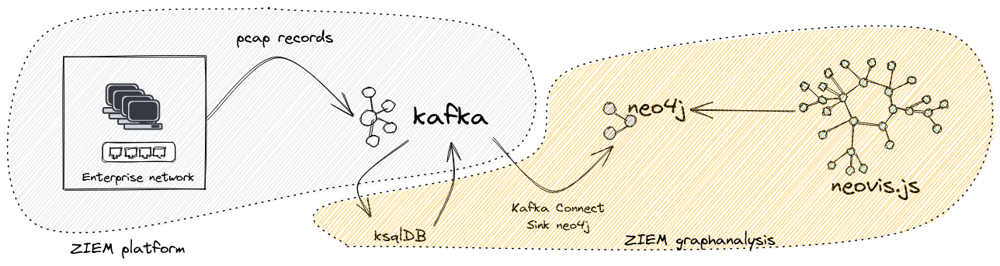

# ZIEM - graphanalysis
This repository contains source code for the graph analysis part of the ZIEM project (SIEM by Zenika).
The project collects network traffic in a Kafka cluster where data is processed with ksqlDB.

The architecture looks like :

# Screenshots

![Neovis visualisation](./img/screenshot_V1.png

# How it works ?

# Links
