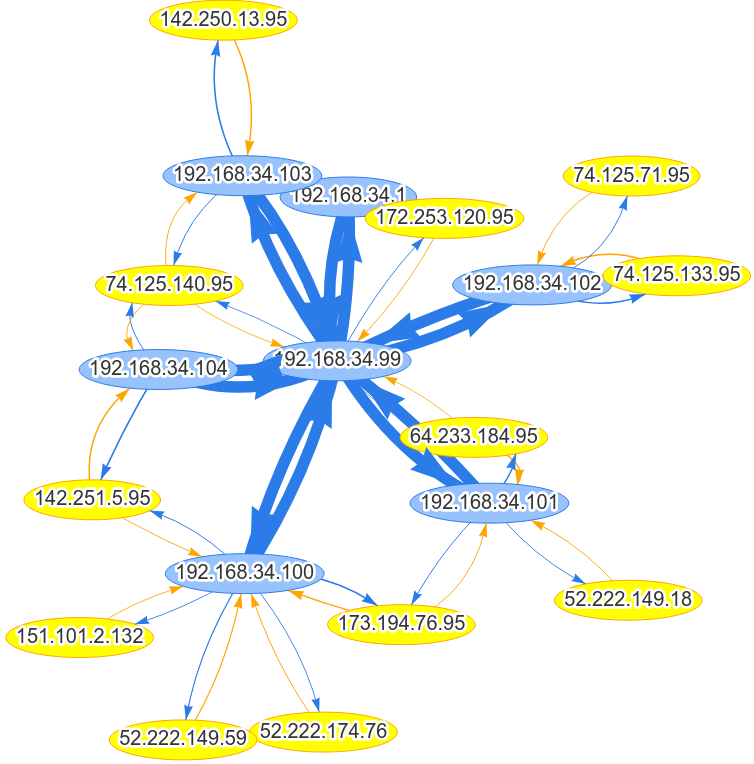

# ZIEM - graphanalysis
This repository contains source code for the graph analysis part of the ZIEM project (SIEM by Zenika).
The project collects network traffic in a Kafka cluster where data is processed with ksqlDB.

The architecture looks like :

# Screenshots

# How does it work ?

Network packets are collected in Kafka then processed with a few ksqlDB scripts to extract
source and destination IP and count the number of packets.

Then a Neo4j Sink Connector reads data from the output topic and send the data to a neo4j instance. Thus data can be viewed and queried in Neo4j browser, but also with neovis.js and give 
the nice visualization above.

# Links

* [ksqlDB](https://ksqldb.io/)
* [Kafka Connect Plugin by Neo4j Streams](https://neo4j.com/labs/kafka/4.0/kafka-connect/) 
* [neo4j](https://neo4j.com/)
* [neovis.js](https://github.com/neo4j-contrib/neovis.js/)
